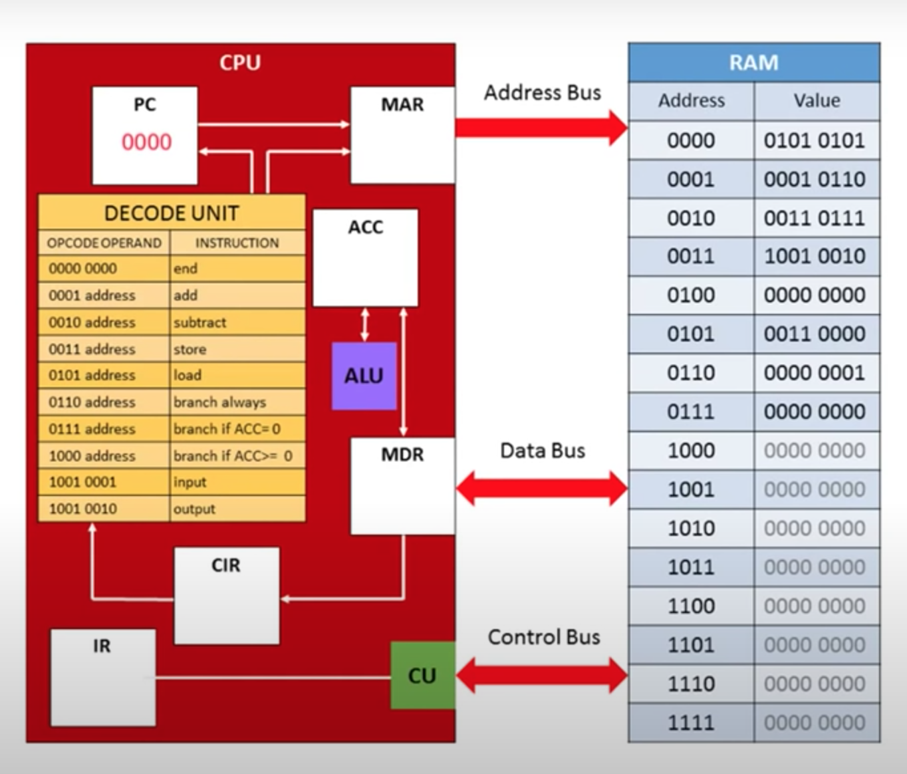

# [Nand2Tetris](https://www.nand2tetris.org)

> Ensure that you have download the related project software tools [here](https://www.nand2tetris.org/software).

## [Project 1](https://www.nand2tetris.org/project01): Boolean Logic

Focuses on the basic boolean logic gates that are the fundamental building blocks that builds a computer. It is made up of transistors known as the [MOSFET (Metal–Oxide–Semiconductor Field-Effect Transistor)](https://en.wikipedia.org/wiki/MOSFET).

The `Nand` would be a primitive gate and gates such as `And`, `And16`, `DMux`, `DMux4Way`, `DMux8Way`, `Mux`, `Mux16`, `Mux4Way16`, `Mux8Way16`, `Not`, `Not16`, `Or`, `Or16`, `Or8Way` and `Xor` would be implemented in this project using HDL (Hardware Description Language).

### How to navigate the project:

1. The boolean table for each logic chip can be found in the related `.cmp` files.
2. The hardware description language (HDL) can be found in the related `.hdl` files.
3. The test scripts are found in the `.tst` files. To run them, run the `./HardwareSimulator.sh` file, click on "Load Script" and select the related `.tst` file.

The primitive chips can be found in the tutorial for "Hardware Simulator" in [here](https://www.nand2tetris.org/software).

### How does the [MOSFET](https://en.wikipedia.org/wiki/MOSFET) transistor works?


<small>(Source: [Wikipedia](https://en.wikipedia.org/))</small>

The MOSFET is made up of silicon and consists of the source, drain and gate terminals.

There are 2 types of MOSFET - the pMOSFET and nMOSFET. In the nMOSFET, the source and drain are n-type and well p-type, and its the opposite for pMOSFET. The n/p-types are created from a process called doping, which introduces a foreign substance to modulate its electrical properties. In this example, we will use the nMOSFET.

The n-type usually introduces another element such as phosphorus (which consists of 5 valence electrons) as it fits with silicon with an extra electron to move around. And as for p-type, it introduces another element such as boron (which consists of 3 valence electrons) as it creates a "hole" for the extra electron to fit in.

This is the default state when no voltage is applied to the gate, since the n-type electron would fit into the p-type "hole" to create the depletion layer in-between the source/drain and the well, where the layer is negative hence effectively creates a barrier against the rest of the moving electrons from the source/drain to the well. This would represent the `0` state.

When positive voltage is applied to the gate, it attracts the electrons from the n-type to the p-type and overcomes the repulsion from the depletion layer (and hence shrinking it). Electric current would flow from source to sink, thus making the `1` state. _Point to recap is that particles becomes negatively charged when it gains electrons, and positively charged when it lacks electrons._


## [Project 2](https://www.nand2tetris.org/project02): Boolean Arithmetic

Focuses on the arithmetic logic gates (built upon the logic gates from Project 1) that creates the ALU (Arithmetic Logic Unit) and itself, which is a part of the CPU (Central Processing Unit).

_See Project 1 on how to navigate the project._


## [Project 3](https://www.nand2tetris.org/project03): Sequential Logic

Focuses on the sequential logic gates that is used to create the RAM. It starts from `Bit` > `Register` > `RAM8` > ... > `RAM4K`.


<small>(Source: [Electronics Tutorials](https://www.electronics-tutorials.ws))</small>

The 1-Bit register state is sequential (e.g. at time = 2 the current stored state is the output of time = 1), and it contains a load flag that enables writes to the bit register, else the state is locked. You could imagine an ever-looping circuit that determines if state changes at every discrete time frame (e.g. `out(t) = in(t-1)`. These Bits would be used to form a Register, and then a RAM/ROM.

_See Project 1 on how to navigate the project._


## [Project 4](https://www.nand2tetris.org/project04): Machine Language

Focuses on the assembly language, which is compiled to machine language. The languages are compiled in such order: high-level > assembly-level > machine-level.

For example, in a high-level code:

```
int c = a * b;
```

Then in an assembly-level code:

```
MOV CX, [AX] ; Moves AX to CX
MUL BX;      ; Result in CX = AX * BX
```

Then in a machine-level compiled code:

```
0000000000000010
1110101010001000
0000000000000001
...
```

For example, the assembly-level command `ADD R1, R2, R9` represents an addition operation from R1 and R2 to be stored into R9 gets compiled into a machine-level code `1010 001100 011001` (where `1010` represents `ADD`, `001100` R1, `0001` R2 and `011001` R3).

### Types of registers:

| Register | Description |
| -------- | ----------- |
| `D` | Used to only store data values. |
| `A` | Used to store the address. |
| `M` | Used to store the current value of the `A`-register which can be manipulated. |

It is vital to understand the registers [within the CPU](https://computersciencewiki.org/index.php/Registers_within_the_CPU).

### How to navigate the project:

1. The assembly scripts are tagged as `.asm` files.
2. The result table for each assembly script is stored in the relevant  `.cmp` files.
3. The test scripts are found in the `.tst` files. To run them,
    1. Run `./Assembler.sh` file, click on "Load Source file" and select the related `.asm` file. Run the script and save the file the output as the relevant `.hack` file.
    2. Run `./CPUEmulator.sh` file, click on "Load Script" and select the related `.tst` file.
    3. If there are any errors, restart the steps from 1 onward.

The Hack assembly commands can be found in the PDF tutorial for "Project 4" in [here](https://www.nand2tetris.org/course).


## [Project 5](https://www.nand2tetris.org/project05): Computer Architecture

Focuses on the building a computer based on the [Von Neumann architecture](https://en.wikipedia.org/wiki/Von_Neumann_architecture) using CPU, ROM, RAM, Scree and Keyboard.

### Instruction Format:

> General format: `[I]---------------` in 16-bit binary.

There are two types of instructions (`[I]`):

- Value `0`: Represents `A`-instruction
- Value `1`: Represents `C`-instruction


**For `A`-instruction**: This is for address instruction.

> Format: `0[MMMMMMMMMMMMMMM]`

| Param | Description |
| ----- | ----------- |
| `0` | The instruction code. |
| `[MMMMMMMMMMMMMMM]` | The 15-bit value stored in the `A`-register from `0..14`. |


**For `C`-instruction**: This is for compute instruction.

> Format: `1--[A][543210][DDD][CBA]`

| Param | Description |
| ----- | ----------- |
| `1` | The instruction code. |
| `[A]` | Determines if it will operate on the `A`-register input or memory (M) input.<br><ul><li>Value `0`: `A`-register input</li><li>Value `1`: Memory (M) input</li> |
| `[543210]` | Determine which function the ALU will compute. Read from right-to-left. Set to `1` (enable instruction) or `0` (disable instruction) in current CPU cycle.<br><ul><li>Position `0`: "no" ALU instruction</li><li>Position `1`: "f" ALU instruction</li><li>Position `2`: "ny" ALU instruction</li><li>Position `3`: "zy" ALU instruction</li><li>Position `4`: "nx" ALU instruction</li><li>Position `5`: "zx" ALU instruction</li></ul>|
| `[DDD]` | Determine which registers should accept ALU result output.<br><ul><li>Value `001`: Store to `D`-register</li><li>Value `010`: Store `A`-register</li><li>Value `100`: Store to memory (M)</li></ul>|
| `[CBA]` | Used for branching control. Read from right-to-left. Set to `1` (enable instruction) or `0` (disable instruction) in current CPU cycle.<br><ul><li>Position `A`: JGT command</li><li>Position `B`: JEQ command</li><li>Position `C`: JLT command</li></ul>|

### Von Neumann Architecture


<small>(Source: [Wikipedia](https://en.wikipedia.org/))</small>

The Von Neumann architecture contains a processing unit with ALU and processor registers, CU (Control Unit) with IR (Instruction Register) and PC (Program Counter), a memory to store data, external storage, and instructions, and I/O (Input/Output) devices such as keyboard, mouse, computer screen, hard-disk. 


<small>(Source: [Wikipedia](https://en.wikipedia.org/))</small>

The CPU, RAM and I/O devices are connected to a system bus that carries information to-and-fro, working as a proxy to determine where a data instruction should be sent. 

It breaks down into 3 types of buses which the CPU utilitises this system bus to interact with the RAM and I/O devices to do operations:

- Data bus: Carries information
- Address bus: Determines where a data should be sent
- Control bus: Determines the operations

Unlike the [Harvard architecture](https://en.wikipedia.org/wiki/Harvard_architecture), the program instructions and data share the same memory and pathways.

### The CPU  

The CPU consists of:

- ALU (Arithmetic Logic Unit): Does arithmetic and logic operations
- CU (Control Unit): Directs the operation of the processor for the ALUs (e.g. what to compute)
- Registers:
    - User-Accessible Registers: Read and written by machines.
        - Data registers: Used for operations (e.g. accumulator).
        - Address registers: Used for holding memory addresses (e.g. RAM/ROM/Cache) used by instructions to access memory data (e.g. read/write data).
        - PC (Program Counter): Used as an instruction pointer for the current memory address.
    - Internal Registers: Used internally by CPU.
        - IR (Instruction Register): Holds the current instruction being executed.
        - Registers for fetching information from RAM memory separate from CPU memory or caches such as the MBR (Memory Buffer Register), MDR (Memory Data Register) and MAR (Memory Address Register).

It also may contain:

- Caches: Memory caches for faster fetches (such as L1/L2 etc.).
- AGU (Address Generation Unit): Calculates addresses used by the CPU to access the main memory (thus executing various machine instructions can be reduced).
- MMU (Memory Management Unit): Translates logical addresses to physical RAM addresses (which acts like a proxy).


<small>(Source: [Youtube @Craig'n'Dave](https://www.youtube.com/channel/UC0HzEBLlJxlrwBAHJ5S9JQg))

On boot, the PC is predefined by the system's architecture, and these typically points to the set of instructions in the ROM (Read-Only Memory).

1. In the Fetch stage, the instruction is fetched from the memory address in the PC and stored in the IR. The PC is then incremented.
2. In the Decode stage, the decoder decodes the encoded instruction.
3. In the Execute stage, the CU passes the instructions to either the ALU (for operations) or the the relevant registers (for reading/writing). 

This cycle is then repeated until shutdown occurs.

In summary, the ROM stores the instructions (read-only), that is retrieved by the CPU to start executing the instructions when the reset button (aka bootup). Each instruction passed to the CPU is either stored/fetched to/from the Address register or Data register, and the PC increments (which may be skip if command is JMP) and hence executing the next instruction.

_See Project 1 on how to navigate the project._


## [Project 6](https://www.nand2tetris.org/project06): The Assembler

Focuses on the assembler that translates the `.asm` (assembly code) file to `.hack` (machine-level code) file.

To understand the formats for `A`-instruction and `C`-instruction, reference the previous project.


### Parser module

The Parser module parses each commands from the assembly language file into readable components such as fields and symbols (with whitespaces and comments removed). 

Commands are filtered into:

| Command Type | Description |
| ------------ | ----------- |
| `A_COMMAND` | The symbol command (e.g. `@TEST`) |
| `L_COMMAND` | The pseudo command (e.g. `(TEST)`) |
| `C_COMMAND` | The code command (e.g. `M=D` or `0;JMP`) |


### SymbolTable module

The SymbolTable module translates the symbols (or variables) into actual addresses (RAM/ROM addresses) as part of the translation process.

For reserved symbols:

| Symbols | Address |
| ------- | ------- |
| `SP` | `0` |
| `LCL` | `1` |
| `ARG` | `2` |
| `THIS` | `3` |
| `THAT` | `4` |
| `SCREEN` | `16384` |
| `KBD` | `24576` |
| `R`[`0`-`15`] | `0` - `15` |

New variables must be stored from address `16` onward.

### Code module

The Code module translates the assembly language mnemonics into binary codes (used in `C`-instruction).

For dest mnemonics (e.g. `M` in `M=A`). Refer to `[DDD]` of `C`-instruction.

| Name | Binary |
| ---- | ------ |
| `null` | `000` |
| `M` | `001` |
| `D` | `010` |
| `MD` | `011` |
| `A` | `100` |
| `AM` | `101` |
| `AD` | `110` |
| `AMD` | `111` |

For comp mnemonics (e.g. `M-D` in `M=M-D`). Refer to `[A][543210]` of `C`-instruction:

| Name | Binary |
| ---- | ------ |
| `M` | `1110000` |
| `!M` | `1110001` |
| `M+1` | `1110111` |
| `-M` | `1110011` |
| `M-1` | `1110010` |
| `D+M` | `1000010` |
| `D-M` | `1010011` |
| `M-D` | `1000111` |
| `D&M` | `1000000` |
| `D\|M` | `1010101` |
| `0` | `0101010` |
| `1` | `0111111` |
| `-1` | `0111010` |
| `D` | `0001100` |
| `A` | `0110000` |
| `!D` | `0001101` |
| `!A` | `0110001` |
| `-D` | `0001111` |
| `-A` | `0110011` |
| `D+1` | `0011111` |
| `A+1` | `0110111` |
| `D-1` | `0001110` |
| `A-1` | `0110010` |
| `D+A` | `0000010` |
| `D-A` | `0010011` |
| `A-D` | `0000111` |
| `D&A` | `0000000` |
| `D\|A` | `0010101` |

For jump mnemonics (e.g. `JMP` in `0;JMP`). Refer to `[CBA]` of `C`-instruction.

| Name | Binary |
| ---- | ------ |
| `null` | `000` |
| `JGT` | `001` |
| `JEQ` | `010` |
| `JGE` | `011` |
| `JLT` | `100` |
| `JNE` | `101` |
| `JLE` | `110` |
| `JMP` | `111` |


### The Assembler
Finally, the Assembler would utilise these modules and work in phases:

1. First pass: Starting from `count=0`, if current command is a `L_COMMAND` from Parser, add to the SymbolTable with address as `count`. Increment `count` if it is not a `L_COMMAND` to load into the ROM address (e.g. `R0` - `R15`).

2. Second pass: For every `A_COMMAND`, add to the SymbolTable with address starting from `16` onward (denoting RAM address) if variable does not exist in the SymbolTable and tabulate into `A`-instruction. For `C_COMMAND`, tabulate the binary representation of the `C`-instruction. Note that `L_COMMAND` is ignored here as it is a pseudo command.


### How to navigate the project

1. Build the assembler into `go` binary via `cd 06/assembler && go build -o ../assembler_exec`.
2. Run `./assembler_exec pong/Pong.asm` for example. Switch the file as needed.
3. Compare the files for testing via `comm -3 rect/RectL.cmp.hack rect/RectL.hack` for example.
